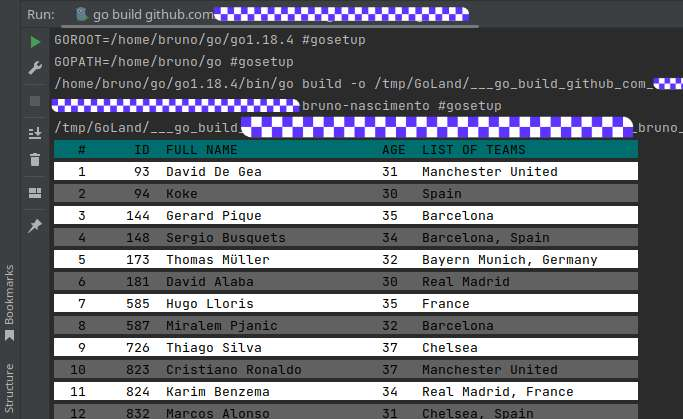
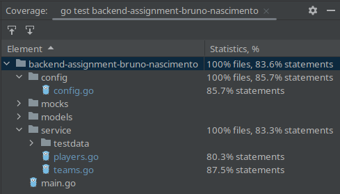

# ACME Inc Backend Take Home Assingment

The task description is in the [TASK.md](TASK.md) file

### Installing 

`go install -x .`

then run it:

`backend-assignment-bruno-nascimento`

### Environment Variables

| NAME                  | DESCRIPTION                                                    | DEFAULT                                    |
|-----------------------|----------------------------------------------------------------|--------------------------------------------|
| APP_TEAMS_LIST        | List of the teams that must be found and retrieve from the API | Gremio                                     |
| CACHE_ENABLED         | Flag the save the teams fetched from the API on the disk       | true                                       |
| CACHE_PATH            | Path where the cache files will be saved                       | $HOME/acme/tech-challenge/bruno-nascimento |
| CACHE_TTL             | Time the cache will be valid                                   | 30s                                        |
| API_ENDPOINT          | URL of the teams API endpoint                                  | https://******/{team_id}.json              |
| API_PARALLEL_REQUESTS | Maximum number of simultaneous requests made                   | `runtime.NumCPU()`                         |

#### Output

#### Test coverage

The mock was generated using `mockery --all --keeptree`

brunocn80@gmail.com - [LinkedIn](https://www.linkedin.com/in/bruno-caldeira-do-nascimento/)

Thank you. It was fun!
